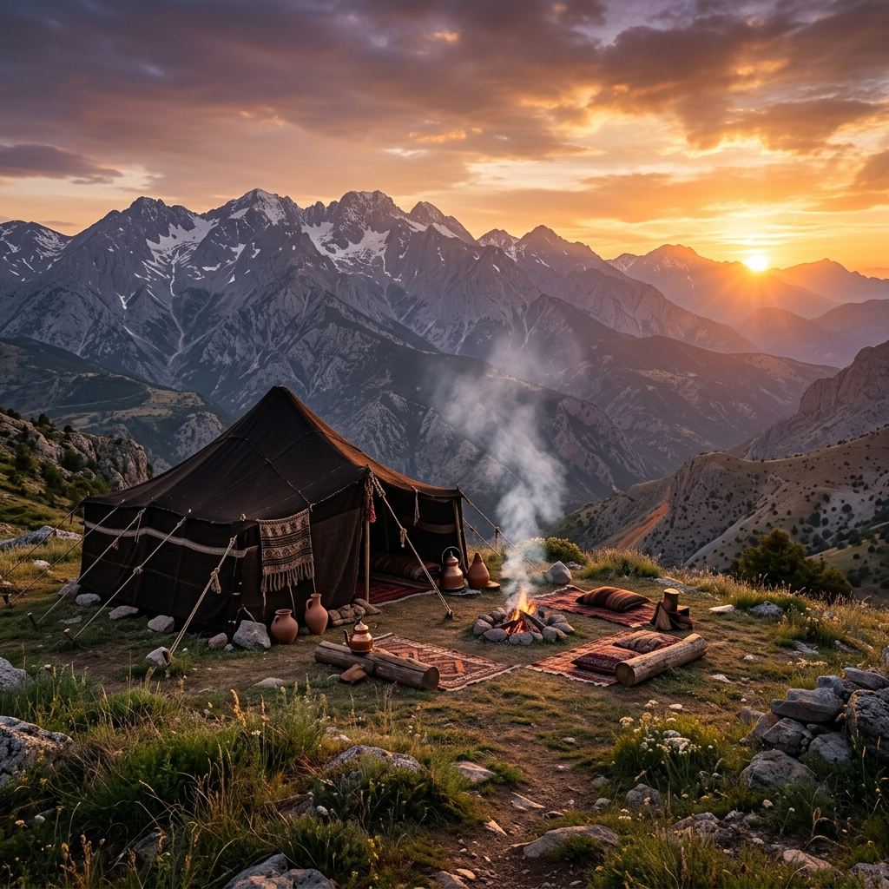

# 🏔️ Yaylak-Yolu: Antalya Yörük Kültürü Dijital Arşivi

> **"Arkadaşlar! Gidip Toros Dağları'na bakınız, eğer orada bir tek Yörük çadırı görürseniz ve o çadırda bir duman tütüyorsa, şunu çok iyi biliniz ki, bu dünyada hiçbir güç ve kuvvet bizi asla yenemez."** — *Mustafa Kemal Atatürk*

---

## 🏛️ Vizyon: Dijital Kültürel Egemenlik
"Yaylak-Yolu", Akdeniz havzasından Toroslar'ın zirvesine uzanan binlerce yıllık Yörük ontolojisinin dijital bir kalesidir. Bu proje, sadece bir veri toplama çabası değil; **Dijital Kültürel Egemenlik** vizyonuyla, yerel bir medeniyet kodunun teknolojik dünyaya aslına sadık kalınarak taşınması sürecidir. 

Bizim için "Göç", sadece mekanlar arası bir yer değiştirme değil, bir **bilgi transferi** ve **hayatta kalma algoritmasıdır**.

---

## 📜 Yörük Manifestosu: Dijital Bozkırın Kanunları

1.  **Hareket Esastır:** Veri akışkan olmalı, statik hiyerarşilerde hapsolmamalıdır.
2.  **Mülkiyet Değil, Emanet:** Bilgi, toprağın üstündeki ot gibidir; herkesin istifadesine sunulur ancak köküne zarar verilmez.
3.  **Töre Yazılı Değildir, Kodlanmıştır:** Kültürel mirasımız, genetik ve toplumsal kodlarımızda saklıdır. Bu arşivi, bu kodların deşifre edilip geleceğe aktarılması için inşa ediyoruz.
4.  **Sadelik En Büyük Teknolojidir:** En sarp dağda hayatta kalan "Kepenek", en gelişmiş veri merkezinden daha dayanıklıdır.

---

## ⚡ Siber-Bozkır Framework (Siber-Bozkır Çerçevesi)

Yörük stratejisi, modern merkezi olmayan sistemler (decentralized systems) için kadim bir prototiptir. "Siber-Bozkır", bu stratejiyi dijital dünyaya entegre eden bir framework'tür:

- **Otonomi:** Her oba (node), merkezi bir otoriteye ihtiyaç duymadan kendi kararlarını (consensus) alabilir.
- **Direnç (Resilience):** Dağıtık yapı sayesinde, sistemin bir parçasının zarar görmesi obanın (ağın) tamamını etkilemez.
- **Adaptasyon:** Değişen iklim ve coğrafya (piyasa ve teknoloji) koşullarına göre anlık rota değişikliği yapabilme yeteneği.

### 🛠️ Yörük-Stack (Geleneksel Teknoloji Katmanı)

| Katman | Geleneksel Karşılığı | Dijital Analoji |
| :--- | :--- | :--- |
| **Hardware** | Kıl Çadır, Kepenek, Keçe | Sunucular, Donanım, Cihazlar |
| **Operating System** | Töre (Sosyal Yazılım) | OS, Çekirdek Yazılım |
| **Database** | Kilim Motifleri, Sözlü Tarih | IPFS, Blockchain, Veritabanı |
| **Networking** | Göç Rotaları, İmece | P2P Protokoller, API'ler |

---

## 🧠 Ontolojik Karşılaştırma: Yörük Ruhu vs. Modernite

| Alan | Yörük Ontolojisi | Modernite (Yerleşiklik) |
| :--- | :--- | :--- |
| **Zaman Algısı** | Döngüsel (Yaylak/Kışlak) | Doğrusal (İlerleme/Tüketim) |
| **Mülkiyet** | Hak ve Kullanım Odaklı | Sahiplik ve Sınır Odaklı |
| **Doğa** | Parçası ve Yoldaşı | Kaynağı ve Hükmedileni |
| **Mimari** | Çadır (Geçici ve Adaptif) | Beton (Kalıcı ve Hantal) |
| **Bilgi** | Sözlü ve Deneysel | Kitabi ve Teorik |

---

## 🧭 Arşiv Haritası (Genişletilmiş)

### 1. 🧠 Felsefi Sütunlar ([felsefe/](felsefe/))
*   **[Ontoloji: Varoluş ve Hareket](felsefe/ontoloji.md)** - Göçebeliğin varoluşsal analizi.
*   **[Etik: Yolun Yasası](felsefe/etik.md)** - Paylaşım ve adalet felsefesi.
*   **[Kozmoloji: Gök ve Yer Dengesi](felsefe/kozmoloji.md)** - Gök Töre ve evren tasavvuru.
*   **[Estetik: Sadeliğin Sanatı](felsefe/estetik.md)** - Yörük sanatının minimalist kökenleri.

### 2. 📜 Sözlü Gelenek ve Edebiyat ([sozler/](sozler/))
*   **[Tarihi Şahsiyetlerin Gözünden Yörükler](sozler/famous-quotes.md)** - Atatürk ve seyyahların sözleri.
*   **[Atasözleri ve Hikmetler](sozler/wisdom.md)** - Bin yıllık tecrübenin özeti.
*   **[Maniler ve Ağıtlar](sozler/maniler.md)** - Toroslar'ın yankılanan sesi.
*   **[Destanlar ve Efsaneler](sozler/destanlar.md)** - Gelin Kaya ve Çoban Yıldızı anlatıları.

### 3. 📖 Dil ve Dilbilim ([sozluk/](sozluk/))
*   **[Kadim Kelimeler Sözlüğü](sozluk/dictionary.md)** - Teknik Yörük terminolojisi.
*   **[Etimolojik Analiz](sozluk/etimoloji.md)** - Öztürkçe'nin izinde kelime arkeolojisi.
*   **[Dilbilimsel Yapı](sozluk/dilbilim.md)** - Arkaik seslerin korunması.

### 4. 🧶 Kültür ve Toplum ([kultur/](kultur/))
*   **[Sosyal Yapı ve Töre Hukuku](kultur/sosyal-yapi.md)** - Oba sistemi ve İmece algoritması.
*   **[Yörük Takvimi](kultur/takvim.md)** - Doğanın ritmiyle zaman yönetimi.
*   **Mutfak:** [Tarifler](kultur/mutfak/tarifler.md) - Ateşin ve dumanın lezzetleri.
*   **Zanaat:** [Dokuma](kultur/zanaat/dokuma.md), [Keçecilik](kultur/zanaat/kececilik.md) & [Motif Semantiği](kultur/zanaat/motifler.md).
*   **İnanışlar:** [Halk İnanışları](kultur/inanis/dogustu.md) - Dağ ruhları ve tabular.
*   **[Hayvancılık ve Çobanlık](kultur/hayvancilik.md)** - Sürü yönetimi ve süt teknolojisi.

### 5. 🗺️ Coğrafya ve Rotalar ([rotalar/](rotalar/))
*   **[Göç Rotaları](rotalar/migration.md)** - Binlerce yıllık "Kutlu Yol" haritaları.
*   **[Meşhur Yaylalar](rotalar/yaylalar.md)** - Boyların mülkiyetindeki zirveler.
*   **[Flora ve Fauna](rotalar/ekosistem.md)** - Toroslar'ın biyolojik sermayesi.

---

## 🚀 Yol Haritası (Roadmap)
- [ ] **Interaktif Göç Haritası:** 3D modelleme ve GPS entegrasyonu.
- [ ] **Yörük-AI Sözlüğü:** Doğal Dil İşleme (NLP) modelleriyle ağız analizi.
- [ ] **Dijital Kilim Arşivi:** Semantik motif veritabanı (Blockchain tabanlı sahiplik).

---

## 🤝 Katkıda Bulunma
Bu oba hepimizin! Katkıda bulunmak için:
1.  Repo'yu **Fork** edin.
2.  Yeni bir **Feature Branch** oluşturun.
3.  Kültürel bir veri, kelime veya hikaye ekleyin.
4.  **Pull Request** gönderin.

---

**Lisans:** MIT Lisansı. 

---
*Antalya'nın sıcağından Toroslar'ın ayazına, bu yol hepimizin. Biz bu yola "Yaylak Yolu" dedik, sonu bağımsızlığa çıksın diye.*